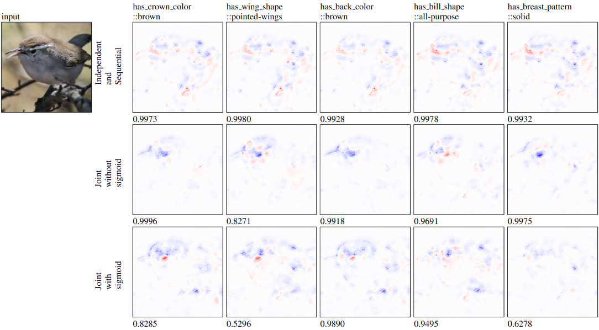
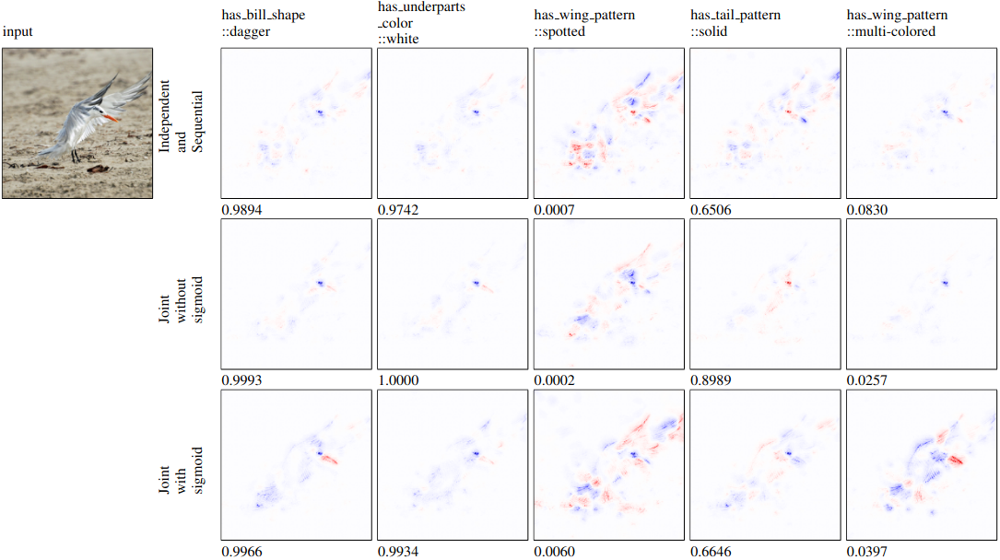
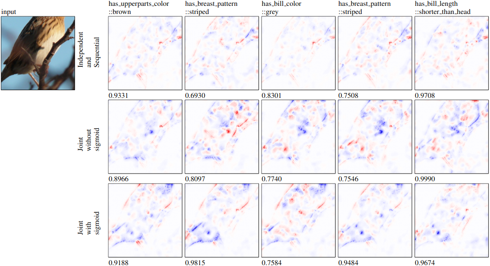
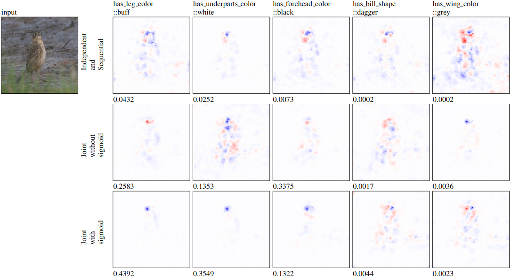
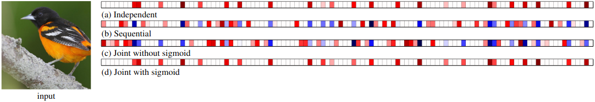
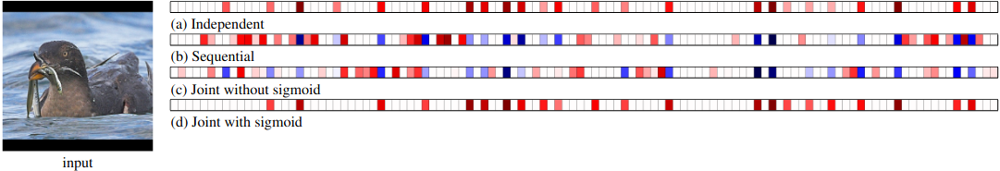
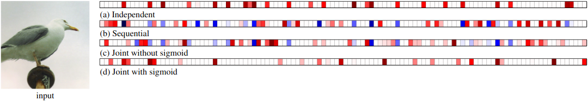
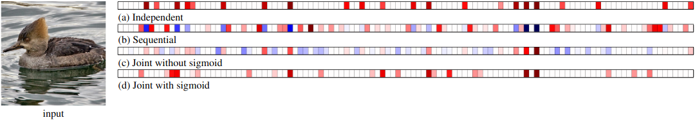

# Explainable Concept Bottleneck Models

This repository contains code and scripts for the paper: [Towards a Deeper Understanding of Concept Bottleneck Models Through End-to-End Explanation](https://arxiv.org/abs/2302.03578).


## Setup

This repository has two Layer-Wise Relevance Propagation implementations included. These are [torchexplain](https://github.com/liamhiley/torchexplain) and [TorchLRP](https://github.com/fhvilshoj/TorchLRP).

### Dataset

Experiments detailed in this reporitory use the dataset [Caltech-UCSD Birds-200-2011 (CUB)](http://www.vision.caltech.edu/datasets/cub_200_2011/).

1. Download the dataset from [http://www.vision.caltech.edu/datasets/cub_200_2011/](http://www.vision.caltech.edu/datasets/cub_200_2011/)
2. Unzip and place in the directory `dataset/CUB/data`
3. Reorganise the dataset structure to be as follows inside the data directory:
```
  |
  |-attributes
  |  |-attributes.txt
  |  |-certainties.txt
  |  |-class_attribute_labels_continuous.txt
  |  |-image_attribute_labels.txt
  |-images
  |  |-001.Black_footed_Albatross
  |  |  |-Black_Footed_Albatross_0001_796111.jpg
  |  ...
  |-parts
  |  |-part_click_locs.txt
  |  |-part_locs.txt
  |  |-parts.txt
  |-segmentations
  |  |-001.Black_footed_Albatross
  |  |  |-Black_Footed_Albatross_0001_796111.png
  |  ...
  |-bounding_boxes.txt
  |-classes.txt
  |-image_class_labels.txt
  |-images.txt
  |-README
  |-train_test_split.txt
```


### Python and packages

It is recommended you use an environment management. Conda was used for these experiments but this repository does not limit to any one option.

Python version: `3.8.12`

1. run `pip install -r requirements.txt`


### Models

This repository does not train models. To reproduce the models from the paper please see [https://github.com/JackFurby/VGG-Concept-Bottleneck](https://github.com/JackFurby/VGG-Concept-Bottleneck). Models should be converted to a state_dict before using here.  The models can also be downloaded from [here](https://huggingface.co/Furby/VGG-Concept-Bottleneck).

1. Place the models in the directory `models/state_dict`


## Usage

Each of the results have been added to individual Jupyter Lab files. Please refer to each file for a full breakdown of the function.

The files `generate_results.py` and `pointing_game.py` will perform an operation on the entire dataset split given. `generate_results.py` repeat the same operations found in the Jupyter lab files and `pointing_game.py` runs a modification to the pointing game, calculating the average distance in pixels from the most salient point and the ground truth point from the dataset.


### generate_results.py

```
arguments
=========
  -h, --help            show this help message and exit
  --model MODEL         XtoC or joint model path
  --rules RULES [RULES ...]
                        LRP rules defined in TorchLRP
  --use_sigmoid         Whether to include sigmoid activation before using attributes to predict Y. For end2end & bottleneck model
  --use_relu            Whether to include relu activation before using attributes to predict Y. For end2end & bottleneck model
  --expand_dim EXPAND_DIM
                        Size of middle layer in CtoY model. Default: 0
  --n_class_attr N_CLASS_ATTR
                        whether attr prediction is a binary or triary classification. Default: 2
  --n_concepts N_CONCEPTS
                        number of concepts. Default: 112
  --n_classes N_CLASSES
                        number of concepts. Default: 200
  --output OUTPUT       output directory path
  --mode {composite,singlar,IG,CtoY}
                        mode to run script. Default: composite
  --samples_per_class SAMPLES_PER_CLASS
                        Max number of samples to generate results for per class in the dataset. Default: 10
  --dataset_split {test,val,train}
                        The dataset split to enumerate. Default test
  --use_cpu             Only use the system CPU, even if CUDA is available
```

Generate composite LRP saliency maps for input to concept vector  
`python generate_results.py --model ./models/state_dict/Joint0.01Model__Seed1.pth --output ./results/ --mode composite --rules alpha1beta0 epsilon gradient`

Generate singlar LRP saliency maps for input to concept vector  
`python generate_results.py --model ./models/state_dict/Joint0.01Model__Seed1.pth --output ./results/ --mode singlar --rules alpha1beta0`

Generate IG saliency maps for input to concept vector  
`python generate_results.py --model ./models/state_dict/Joint0.01Model__Seed1.pth --output ./results/ --mode IG`

Generate CtoY results  
`python generate_results.py --model ./models/state_dict/Joint0.01Model__Seed1.pth --output ./results --mode CtoY`


### pointing_game.py

```
arguments
=========
  -h, --help            show this help message and exit
  --model MODEL         XtoC or joint model path
  --rules RULES [RULES ...]
                        LRP rules defined in TorchLRP
  --use_sigmoid         Whether to include sigmoid activation before using attributes to predict Y. For end2end & bottleneck model
  --use_relu            Whether to include relu activation before using attributes to predict Y. For end2end & bottleneck model
  --expand_dim EXPAND_DIM
                        Size of middle layer in CtoY model. Default: 0
  --n_class_attr N_CLASS_ATTR
                        whether attr prediction is a binary or triary classification. Default: 2
  --n_concepts N_CONCEPTS
                        number of concepts. Default: 112
  --n_classes N_CLASSES
                        number of concepts. Default: 200
  --output OUTPUT       output directory path
  --mode {composite,singlar,IG,CtoY,conceptImportance}
                        mode to run script. Default: composite
  --samples_per_class SAMPLES_PER_CLASS
                        Max number of samples to generate results for per classification. -1 to run all. Default: 10
```

LRP pointing game  
``python pointing_game.py --model ./saves/CBM_paper/state_dict/Joint0.01SigmoidModel__Seed1.pth --rules alpha1beta0 epsilon gradient --output ./results/ --mode LRP --samples_per_class -1``

IG pointing game  
``python pointing_game.py --model ./saves/CBM_paper/state_dict/Joint0.01SigmoidModel__Seed1.pth --output ./results/ --mode IG --samples_per_class -1``

Saliency (baseline) pointing game
``python pointing_game.py --model ./saves/CBM_paper/state_dict/independant_seed1.pth --output ./results/ --mode vanilla --samples_per_class -1``

## Results

Full breakdown of results can be found in the [paper and supplementary material](https://arxiv.org/abs/2302.03578).

### XtoC saliency maps


*Figure 1: All concepts were correctly predicted as present. The input class was Bewick wren.*  


*Figure 2: Concepts are a mixture of present, not present, correctly predicted and not correctly predicted. The input class was Elegant tern.*  


*Figure 3: Saliency maps for x → c models with the input of a Le Conte Sparrow image. Concepts shown are either incorrectly predicted as present or correctly predicted as present but not visible in the input image. The input class was Le Conte Sparrow.*  


*Figure 4: Saliency maps for x → c models with the input of a Nelson Sharp tailed Sparrow image. Concepts shown are either correctly or incorrectly predicted as not present. The input class was Nelson Sharp tailed Sparrow.*


### CtoY saliency maps


*Figure 5: Saliency maps for c → y for each training method where the final classification is correctly predicted as Baltimore Oriole.*  


*Figure 6: Saliency maps for c → y for each training method where the final classification is correctly predicted as Rhinoceros Auklet.*  


*Figure 7: Saliency maps for c → y for each training method where the final classification is incorrect. The correct class is Herring gull and the predicted class was California gull for the independent model, Western gull for joint-without-sigmoid model, Nashville warbler for the joint-with-sigmoid model and Red legged kittiwake for the sequential mode*  


*Figure 8: Saliency maps for c → y for each training method where the final classification is incorrect. The correct classification is Hooded Merganser. The predicted classifications were Red breasted Merganser for the independent model, joint-without-sigmoid model and sequential model, and Godwall for the joint-without-sigmoid model.*
